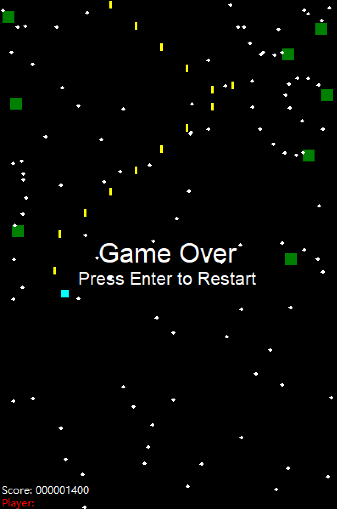

# touhou-cursorai ~ algorithmic spellcasters' banquet

<div align=center>

</div>

**(该部分由Bing AI参与创作 | Written with Bing AI)**

> 灵梦从CursorBot那里抢来了一封“算法法师宴会”的邀请函——这是个著名的活动，法师们能用算法赢取奖金。这个宴会吸引了不少赛博召唤物参与。可是灵梦并不关心什么是算法，她只要奖金——显然，比起算法，她有直接的获奖方式。她想出了一个简单的计划：从物理上击败所有赛博召唤物，轻松获得奖品。

> Reimu seized an invitation from CursorBot to attend the “Algorithmic Spellcasters’ Banquet,” a prestigious event where spellcasters compete for a prize using algorithmic magic. Many AI bots were eager to participate. Reimu was interested in the prize but had no idea what “algorithms” meant - obviously, she preferred more straightforward methods over algorithms. So she came up with a simple plan: literally defeat all the AI competitors and easily claim the prize.

**注意: ** 大部分代码是由[Cursor | Build Fast](https://www.cursor.so/)编辑器完成。名字也是AI起的。

**NOTE:** Mostly written by the [Cursor | Build Fast](https://www.cursor.so/) AI editor(including the game name).


### Controls | 控制

**(该部分由[Cursor](https://www.cursor.so/)生成 | Generated by [Cursor](https://www.cursor.so/))**

- `W`: Move up | 上
- `A`: Move left | 下
- `S`: Move down | 左
- `D`: Move right | 右
- `Shift_L`: Slow down movement | 低速模式
- `Space`: Shoot bullets | 射击
- `P`: Pause/Resume the game | 暂停
- `Enter`: Restart the game (when game over) | 重新开始


### Game Mechanics | 游戏机制

**(该部分由[Cursor](https://www.cursor.so/)生成 | Generated by [Cursor](https://www.cursor.so/))**

- The player starts with 5 HP.
- The player can shoot bullets to defeat enemies.
- Colliding with an enemy or enemy bullet will reduce the player's HP.
- The game ends when the player's HP reaches 0.
- The player's score increases by 100 points for each enemy defeated.


### Run | 运行

```
python ./TouHouCursorai.py
```

Or run the built exe file under `./build` folder.
